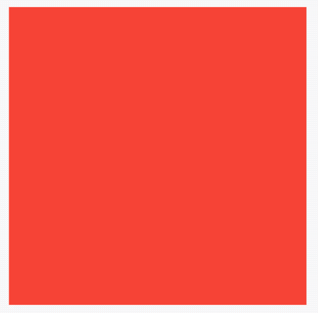

# AnimatedSwitcher

 AnimatedSwitcher在2个或者多个子组件之间切换时使用动画，基本用法如下：

```dart
var _currChild = Container(
    key: ValueKey("1"),
    height: 300,
    width: 300,
    color: Colors.red,
  );

AnimatedSwitcher(
      duration: Duration(seconds: 1),
      child: _currChild,
)
```

`duration`参数为动画执行时间。

点击按钮切换为另一个子组件：

```dart
RaisedButton(
  onPressed: () {
    setState(() {
      _currChild = Container(
                  key: ValueKey("2"),
                  height: 100,
                  width: 100,
                  color: Colors.blue,
                );
    });
  },
),
```

切换的子组件一定要有不同的key，子组件从红色切换到蓝色，默认情况下使用的动画是FadeTransiton，即渐隐渐显。效果如下：


我们也可以使用其他动画，比如缩放动画、旋转动画等，缩放动画用法如下：

```dart
AnimatedSwitcher(
  duration: Duration(seconds: 1),
  child: _currChild,
  transitionBuilder: (Widget child, Animation<double> value) {
    return ScaleTransition(
      child: child,
      scale: value,
    );
  },
)
```

缩放动画效果如下：




通过`switchInCurve`和`switchOutCurve`参数是进出场动画执行的曲线，默认直线执行，系统提供了很多中动画执行曲线，比如加速、减速、弹簧等，用法如下：

```dart
AnimatedSwitcher(
  switchInCurve: Curves.easeIn,
  ...
)
```

`transitionBuilder`参数是转换动画，如上面缩放动画。

`layoutBuilder`是定位子组件位置的函数，用法如下：

```dart
AnimatedSwitcher(
  duration: Duration(seconds: 1),
  child: _currChild,
  layoutBuilder: (Widget currentChild, List<Widget> previousChildren){
    return Stack(
      children: <Widget>[
        ...previousChildren,
        currentChild
      ],
      alignment: Alignment.center,
    );
  },
)
```

将当前的子组件和前面的子组件封装在Stack中，叠加显示。

