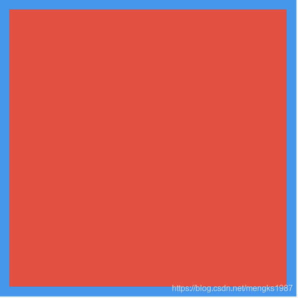

# PositionedDirectional

PositionedDirectional用于定位Stack子组件，PositionedDirectional必须是Stack的子组件，基本用法如下：

```dart
Stack(
  children: <Widget>[
    PositionedDirectional(
      start: 10,
      end: 10,
      top: 10,
      bottom: 10,
      child: Container(color: Colors.red),
    ),
  ],
);
```



相关说明：

- 提供`top`、`bottom`、`start`、`end`四种定位属性，分别表示距离上、下、开始、结尾的距离。

- 只能用于Stack组件中。

- `start`、`end`和`width`3个参数只能设置其中2个，因为设置了其中2个，第三个已经确定了，同理`top`、`bottom`和`height`也只能设置其中2个。

- PositionedDirectional的textDirection（文本）方向为系统默认方向，不受Stack组件控制。

- PositionedDirectional实际上是`Positioned.directional`封装的，源码如下：

  ```dart
  @override
  Widget build(BuildContext context) {
    return Positioned.directional(
      textDirection: Directionality.of(context),
      start: start,
      top: top,
      end: end,
      bottom: bottom,
      width: width,
      height: height,
      child: child,
    );
  }
  ```

